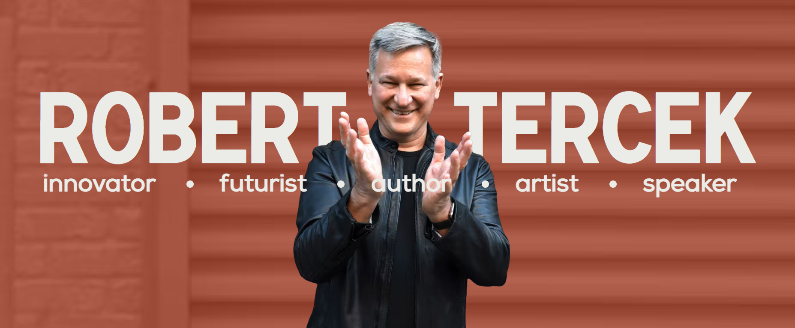
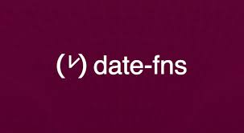
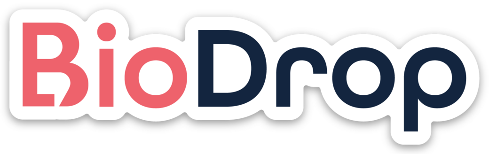

 

  

    <a target="_blank" href="https://kenbeaudin.netlify.app"><strong>Portfolio Website</strong></a>
    ·
    <a target="_blank" href="https://www.linkedin.com/in/ken-beaudin-9a4061174/"><strong>Linkedin</strong></a>
    ·
    <a target="_blank" href="https://twitter.com/kb9700"><strong>Twitter</strong></a>
    ·
    <a target="_blank" href="https://angel.co/u/ken-mathieu-beaudin"><strong>Wellfound</strong></a>
    ·
    <a target="_blank" href="https://drive.google.com/file/d/1Y8TSdxUyA6JaKvpXLi_F2vL1p8J9sVn0/view"><strong>Resume</strong></a>
  

 

<!-- FREELANCE -->
<h1 style="padding-top:64px">Hi! I'm Ken Beaudin.</h1>
 
A full stack developer with a background in sales & business consulting with a passion for creating web applications. I am a creative problem solver with excellent team skills due to my background and I am looking for a position on your team!

When I am not working on a passion project, you will find me at the gym or blogging about interanationalizing web applications, open source projects, learning languages(I speak English, French and now learning Spanish), and traveling (16 countries in the last 5 years)!

See [my website](https://kenbeaudin.netlify.app) for more information!

 

<h1 align="center" style="padding-top:64px">Freelance Work</h1>
<table bordercolor="#66b2b2">
  <tr>
   <td width="50%" valign="top">
      <h3 align="center">Robert Tercek</h3>
         
        <a target="_blank" href="https://roberttercek.com/">
        

            
        

        </a>
         
        
    
    
  
      

        
<strong>HTML, CSS, Next.js, Node.js, NPM, Git, Github & Strapi</strong> - Robert Tercek is one of the world’s most prolific creators of interactive content. He has created breakthrough entertainment experiences on every digital platform. I collaborated with a team of developers to convert the website's API from a Wordpress GraphQL setup to a Strapi backend.

    </td>
  </tr>
</table>

<!-- OPEN SOURCE CONTRIBUTION -->
<!-- BIODROP -->
<h1 align="center" style="padding-top:64px">Open Source Contribution</h1>
<table bordercolor="#66b2b2">
  <tr>
    <td width="50%" valign="top">
      <h3 align="center">Date-fns</h3>
         
        <a target="_blank" href="https://github.com/date-fns/date-fns">
        

            
        

        </a>
         
        

          
    
     
<!--       -->
      

        
<strong>Node.js, TypeScript, Git and Github</strong> - Date-fns is a lightweight JavaScript library that provides a comprehensive set of functions for manipulating and formatting dates in a functional programming style. Introduced formatRFC822 standard which specifies a syntax for text messages that are sent among computer users, within the framework of "electronic mail.

    </td>
  </tr>
</table>

<!-- OPEN SOURCE CONTRIBUTION -->
<!-- CCXT -->

<!-- <h1 align="center" style="padding-top:64px">Open Source Contribution</h1> -->
<table bordercolor="#66b2b2">
  <tr>
    <td width="50%" valign="top">
      <h3 align="center">CCXT</h3>
         
        <a target="_blank" href="https://github.com/ccxt/ccxt">
        

            
        

        </a>
         
        

          
    
<!--    -->
     
     
      

        
<strong>TypeScript, Node.js, Docker, Git, Github & Third Party API's</strong> - The CCXT library is used to connect and trade with cryptocurrency exchanges and payment processing services worldwide. It provides quick access to market data for storage, analysis, visualization, indicator development, algorithmic trading, strategy backtesting, bot programming, and related software engineering.

    </td>
  </tr>
</table>

<h1 align="center" style="padding-top:64px">Open Source Contribution</h1>
<table bordercolor="#66b2b2">
  <tr>
    <td width="50%" valign="top">
      <h3 align="center">Biodrop</h3>
         
        <a target="_blank" href="https://www.biodrop.io/">
        

            
        

        </a>
         
        

          
    
<!--    -->
     
     
      

        
<strong>HTML, CSS, Next.js, React, Node.js, MongoDB, Docker, Tailwind, Git, Github</strong> - Open source contributor to Biodrop an open-source project to connect users to their audience with a single link
showcasing the content they create and their projects in one place.

    </td>
  </tr>
</table>

<!-- BLOG -->

<h1 align="center" style="padding-top:64px">Blog</h1>
<table bordercolor="#66b2b2">
  <tr>
   <td width="65%" valign="top">
      <h3 align="center">Comprehensive Next.js Guide for Internationalizing and Localizing Your Web Application</h3>
         
        <a target="_blank" href="https://kenbeaudin.hashnode.dev/">
        

            
        

        </a>
         
        
    
    
    
      

        
<strong>HTML, CSS, Next.js, React, Node.js, Tailwind, Git, Github, GitHub Actions, CIDC, Jest, Testing Library & Playwright</strong> - Comprehensive Next.js Guide for Internationalizing and Localizing Your Web Application using next-i18next.

    </td>
  </tr>
</table>

<h1 align="center" style="padding-top:64px">Personal Projects</h1>
<table bordercolor="#66b2b2">
  <tr>
    <td width="50%" valign="top">
      <h3 align="center">mTrade</h3>
         
        <a target="_blank" href="https://next-mtrade-lime.vercel.app/">
            

            
            

        </a>
         
        
    
    
  
      

        
<strong>HTML, CSS, SASS, Next.js, React, Node.js, PostgreSQL, Next-i18next, Next-auth, Git, Github, Playwright, Vercel, Superbase & Prisma</strong> - Internationalized full-stack, responsive web application that enables users to consolidate, analyze, and visualize digital asset data from private APIs across multiple platforms 

    </td>
  </tr>
</table>

<!-- TEAM PROJECT -->

<h1 align="center" style="padding-top:64px">Collaboration</h1>
<table bordercolor="#66b2b2">
  <tr>
   <td width="65%" valign="top">
      <h3 align="center">eRenaissance</h3>
         
        <a target="_blank" href="https://erenaissance-frontend.vercel.app/">
        

            
        

        </a>
         
        
    
    
  
      

        
<strong>HTML, CSS, CSS Modules, React, Webpack, Node.js, Webpack, MongoDB, TypeScript, Vercel & Git</strong> - eRenaissance is a custom-built state-of-the-art e-commerce website with Stripe integration built by over four developers!

    </td>
  </tr>
</table>

 

<h1 align="center" style="padding-top:64px">Technologies</h1>

    
    
    
    
    
    
    
    
    
    
    
    
    
    
    
    
    
    

---
 
<section align="center" style="padding-top:64px">
    <h1>Codewars</h1>
    

        
    

</section>

 
<h1 align="center" style="padding-top:64px">Connect</h1>

  

    <a href="https://kenbeaudin.netlify.app"><strong>Portfolio Website</strong></a>
    ·
    <a href="https://www.linkedin.com/in/ken-beaudin-9a4061174/"><strong>Linkedin</strong></a>
    ·
    <a href="https://twitter.com/kb9700"><strong>Twitter</strong></a>
    ·
    <a href="https://angel.co/u/ken-mathieu-beaudin"><strong>Wellfound</strong></a>
    ·
    <a href="https://drive.google.com/file/d/1Y8TSdxUyA6JaKvpXLi_F2vL1p8J9sVn0/view"><strong>Resume</strong></a>
  

<!-- Resources -->
<!-- Icons: https://simpleicons.org/ -->
<!-- Emojis: https://emojipedia.org/emoji/ -->
<!-- HTML Emojis: https://www.fileformat.info/index.htm -->
<!-- Shields: https://shields.io/ -->

