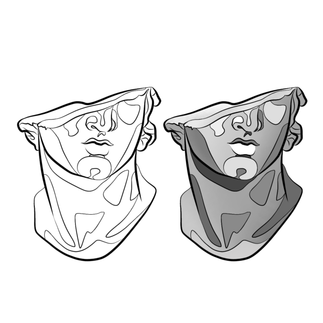

  
  
  
  
  

<section align="center">
    <h3>Codewars</h3>
    

        
    

</section>

<h1>Hi, I'm Ken Beaudin</h1>

I love finding solutions

Formerly a business consultant and certified financial planner with 15 years of experience, I am always looking for ways to improve user experience with elegant solutions. Throughout my career, I was always good at initiating, coordinating, and executing technical concepts.

Helping others grow is a passion of mine, and I strive to solve problems with the best solution every time.

Let's connect and grow together!
See [my website](https://kenbeaudin.netlify.app) for more information!

<h1 align="center">Projects</h1>
<table bordercolor="#66b2b2">
  
  <tr>
    <td width="50%" valign="top">
      <h3 align="center">eRenaissance</h3>
         
        
         
        

          
    
  
      

        
<strong>HTML, CSS, CSS Modules, React, Exprss.js, Node.js, MongoDB, Webpack,TypeScript, Git, CIDC Gitub Actions & Jest</strong> - eRenaissance is a custom built state of the art ecommerce website with Stripe intergration!

    </td>
    <td width="50%" valign="top">
      <h3 align="center">tweetAssist</h3>
         
        
         
        

          
    
  
      

        
<strong>HTML, CSS, Node.js,Express.js, MongoDB, Mongoose, Git, Heroku, Mocha, Jest & JWT Token</strong> - tweetAssist is a web application for  automating tweets and conducting engagement analysis easily and securly!

    </td>
  </tr>
  
  <tr>
    <td width="50%" valign="top">
      <h3 align="center">kenbeaudin.netlify.app</h3>
       
        
       
        

  
  
      

        
<strong>HTML5, CSS3, Javascript, Node.js, NPM, Webpack, Git & Netlify</strong> - Portfolio Site including links to my projects and ways to get in contact with me.

    </td>
    <td width="50%" valign="top">
      <h3 align="center">AfterWerk</h3>
         
        
         
        

          
  
  
      

        
<strong>HTML, CSS, SASS, Node.js, NPM, Git & Netlify</strong> - After Werk is a lifestyle brand dedicated to being your best outside work. We enable connecting with others through fun events, practissing self-care with help from products in our online store.

    </td>
  </tr>
  <tr>
       <td width="50%" valign="top">
      <h3 align="center">Prognose</h3>
       
        
       
        

  
  
      

        
<strong>HTML, CSS, SASS, JavasSript, Gulp, Node.js, NPM, PHP, Git, cPanel, Google Cloud</strong> - Specializes in consulting and deploying budget control solutions, costing and analyzing the profitability of your products, customers and processes.

    </td>

  </tr>
</table>

<h1 align="center">Technologies</h1>

    
    
    
    
    
    
    
    
    
    
    
    
    
    
    
    
    
    

---

<h1 align="center">Connect</h1>

  
  
  
  
  

<!-- Resources -->
<!-- Icons: https://simpleicons.org/ -->
<!-- Emojis: https://emojipedia.org/emoji/ -->
<!-- HTML Emojis: https://www.fileformat.info/index.htm -->
<!-- Shields: https://shields.io/ -->
